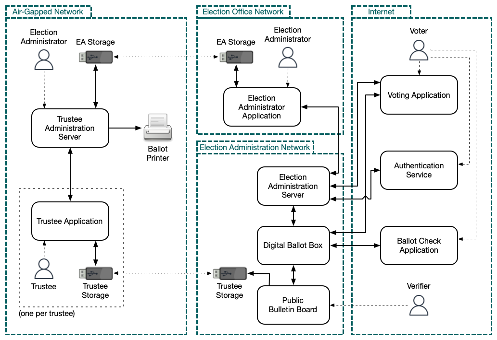
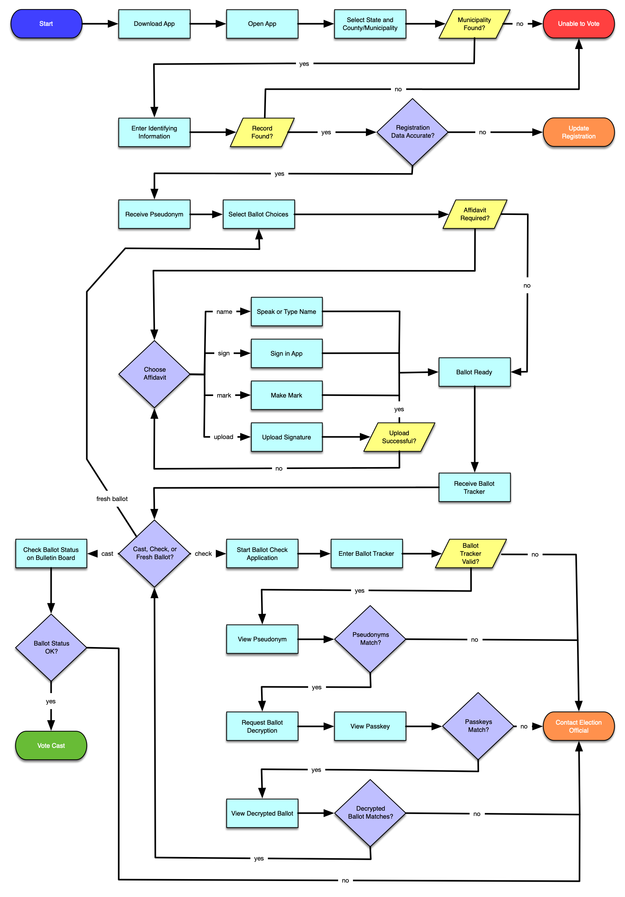

# CONOPS

## Executive Summary

This document provides a high-level concept of operations (CONOPS) for an end-to-end verifiable Internet voting (E2E-VIV) system enabled by the E2E-VIV protocol family created for Tusk-Montgomery Philanthropies. The document particularly focuses on the security and verifiability of the system, and covers system operations from a voter and election official perspective.

## E2E-VIV System Mission

The E2E-VIV system, henceforth referred to as “the system”, is an Internet-connected, digital replacement for traditional absentee voting systems. The system is enabled by a cryptographic protocol from the E2E-VIV protocol family, which handles the core process of voting and vote verification.

The design of the system is in alignment with the objectives outlined in *Vote With Your Phone* by Bradley Tusk, which in turn is based upon the requirements stated in the *Future of Voting* report published by the U.S. Vote Foundation. The system is built with future certification by the appropriate governing bodies in mind. The system architecture is chosen to facilitate the generation of evidence for a system wide assurance case; the cryptographic protocol assurance case is a subset of this system wide assurance case.

The system provides voters with a secure method of casting an end-to-end verifiable ballot using an application on a mobile device. It supports printing of cast ballots for tabulation by traditional absentee ballot tabulation systems and processes. The system is optimized for usability, accessibility, and participation in optional verification steps. The system is designed to be run and configured by a local election official using the same federally-specified data format as other digital election systems.

The system consists of the following ten primary subsystems: Voting Application, Authentication Service, Public Bulletin Board, Digital Ballot Box, Trustee Application, Trustee Administration Server, Election Administration Server, Election Administrator Application, Ballot Check Application, and Ballot Printer. A system diagram detailing the information flow relationships among subsystems is provided below.

The purpose of the system is to reduce the cost and complexity of absentee voting, to increase voter participation (especially by voters who are overseas or have disabilities), and to pave the way for satisfying regulatory requirements to operate mobile voting systems at large scale in future elections in the United States. The goal of developing the system is to see widespread adoption of mobile phone based absentee voting by local election officials in the United States and thus realize the benefits of increased voter participation and reduced cost.

## E2E-VIV Protocol Family Mission

The protocol family is a set of related cryptographic protocols that follow a single core structure while capturing feature variance as protocol instances in the family. The protocols facilitate the security-critical core functionality of end-to-end verifiable Internet voting such as casting a vote, verifying the vote is cast as intended, tracking the vote record to ensure it is tabulated, and outputting a set of votes along with evidence of the correctness of the election.

The protocol family serves to provide a specific protocol variant specialized for the ballot type and voting system used in a particular election. This reduces the complexity of each protocol instance by only supporting the required features. The ability to have different features present in different specific protocol instances allows the protocol family to be utilized in many different election types and jurisdictions. Furthermore, the flexibility of having different protocol variants facilitates ease of adoption of the protocol family by manufacturers of full-fledged voting systems.

Voting system security is of the utmost importance; therefore, the cryptographic protocol and underlying algorithms are formally specified with rigorous verification of correct design and implementation. The core cryptographic protocol is the most security critical aspect of an E2E-VIV system. Furthermore, cryptographic protocols and algorithms are notoriously difficult to design and implement securely. Therefore, a core mission of the cryptographic protocol family is seeing widespread adoption of this protocol family, as it has a level of evidence of its security claims only matched by other critical national security infrastructure.

An assurance case is created using the principles of rigorous digital engineering for the correctness of the cryptographic protocol family design and implementation. A refinement process begins with the most abstract models of the protocol design, which are then refined into an executable specification of the protocol. This executable specification is further refined into an implementation of the protocol family. The assurance case provides traceability between all steps in the refinement process ending with leaf nodes of evidence supporting the assurance claims. The assurance case for the protocol family is intended to be wholly included in an assurance case for a full-fledged voting system. The goal of the assurance case for the protocol family is to support government review and certification of multiple full-fledged voting systems that adopt it.

The purpose of the protocol family is to implement the critical aspects of end-to-end verifiable Internet voting for many different election types and jurisdictions, with exceptional evidence of security, with an assurance case enabling regulatory approval, and see it incorporated into multiple full-fledged voting systems. The goal of the protocol family is to see regulatory approval and widespread use of secure end-to-end verifiable Internet voting systems by multiple vendors.

## Command and Control

Each local election is facilitated by a separate instance of the system. Each instance is under the command and control (C\&C) of a local election official for configuration and initialization using the C\&C interface. Control of the digital ballot box is entrusted to trustees who each hold a partial share of the cryptographic key being used in the election.

The C\&C interface is used to upload the ballot definition files, which are already part of local election official workflows. The election official uses the C\&C interface to specify the opening and closing time of the ballot box, the permitted forms of identification for voter lookup, and the affidavit forms accepted under the appropriate local election regulations. Voter registration information is provided to the authentication server to facilitate authentication of authorized voters.

## Environment

The system is deployed across four environments: Internet connected mobile devices, private/public clouds, election office local area networks, and an air gapped network. The mobile application is distributed in the major mobile operating system native application stores and installed on Internet connected mobile devices. The application server, authentication server, affidavit server, and digital ballot box application are deployed in some combination of public and private cloud infrastructure. The servers may communicate with one another over the open Internet or within virtual private networks. The trustee application and trustee administration server are deployed to an air gapped network.

Each of these environments is assumed to have malicious threat actors present. The system is designed explicitly to mitigate the threats posed by these actors. The Internet connected mobile device is expected to have applications (e.g., TikTok) installed that could be leveraged by a nation-state threat actor as a beachhead to compromise the mobile voting application. The public and private cloud infrastructure is assumed to be actively under attack by remote threat actors, insiders, and administrators. The election office local area network is assumed to be compromised by malicious devices planted in the network. Election officials and their delegates are assumed to be potential bad actors. It is assumed that advanced persistent threats (APTs) have access to all environments.

## Auditability

The core libraries for the mobile voting application, digital ballot box, trustee application, trustee administration server, election administration server, and cryptographic protocol are fully open source, available for unrestricted use, testing, and analysis by any third party. Anyone can not only access the code and specifications but also conduct their own static and dynamic analyses and even perform red-teaming. This unrestricted transparency is critical to build trust amongst stakeholders in the correct and secure operation of the system.

## Verifiability

The core enabler of Internet enabled mobile voting is *end-to-end verifiability*. The three core aspects of an end-to-end verifiable ballot are *cast as intended*, *received as cast*, and *tallied as cast*.

### Cast as Intended

The cast as intended property ensures that a voter who intended to cast a ballot for a particular set of candidates and choices actually did cast a vote for that set of candidates and choices. This is verified with the ballot check. The *Voting Application* commits to an encryption of the ballot without knowing whether it is to be cast or checked. If the ballot is then checked, a copy of it is decrypted locally and displayed by the *Ballot Check Application*, and the voter verifies that the candidates and choices they selected in the *Voter Application* are shown as chosen. The ballot can then be cast, and is left encrypted until it reaches the point in the tally process where it must be decrypted (on an air-gapped network) for printing.

### Recorded as Cast

The recorded as cast property ensures that the encrypted ballot received in the digital ballot box is the same as the encrypted ballot the voter created on their mobile device. This is verified with the ballot tracker, by matching the ballot tracker rated by the mobile application from the digital ballot with the ballot tracker in the public digital ballot box.

### Tallied as Cast

The tallied as cast property ensures that all encrypted ballots accepted into the digital ballot box are included in the final tally, after the ballots have been mixed and decrypted. Mathematical proofs are created during mixing that allow trustees to verify no ballots were added, removed, or modified. Additionally, the decryption of the ballots is performed jointly by a quorum of the trustees who verify the validity of the partial decryptions of each ballot.

## Operation

The main operational functions of the system vary according to the configuration but include *initialize an election*, *cast an individual ballot*, *verify an individual ballot*, *mix and decrypt all ballots*, and *print all ballots*. The following collection of high level scenarios of the system covers both normal and exceptional operation.

### Normal Operation

*Initialize an Election.* The election official uses the election administrator application and connects to the election administration server to create a new election, set the election configuration for this election, set the affidavit options, load a ballot definition file into the system, and set the opening/closing times for the election. The election official uses the election administrator application and connects to the authentication service through the election administration server to set the collection of authorized voters. The trustees use the trustee application and connect to the trustee administration server to jointly create key shares and sign the election public key. The election official uses the election administrator application and connects to the election administration server to open the election.

*Cast an Individual Ballot.*  The voter uses the voting application and connects to the authentication service which performs voter lookup and authenticates the voter, providing the voter with a pseudonym. The voter uses the voting application and connects to the election administration server which determines the correct ballot and presents it to the voter along with the affidavit options for that ballot. The voter uses the voting application to locally record ballot selections and complete the affidavit. The voter uses the voting application, which connects to the digital ballot box to submit the ballot and generate the ballot tracker. The voter uses the ballot check application, which creates a fresh key pair for the ballot check session (the "ballot check public key" and "ballot check private key"), then connects to the public bulletin board to retrieve ballot information and present the ballot pseudonym to the user. The voter sees that the pseudonym matches the one they were provided by the voting application and instructs the ballot check application to retrieve ballot decryption information. The ballot check application retrieves that information by communicating with the voting application (mediated by the digital ballot box) using the ballot tracker, and presents the ballot check public key (as a human readable and comparable code) to the voter. The voter uses the voting application to view the ballot check public key and compare with the ballot check public key seen in the ballot check application. The voter sees that the keys match and uses the voting application, which sends the ballot randomizers to the ballot check application. The ballot check application uses these to decrypt the ballot and display the voter's choices. The voter sees that the choices on the decrypted ballot match those the voter made, and uses the voting application, which connects to the digital ballot box to cast the ballot. The voter uses the ballot check application to check that the ballot was correctly cast on the public bulletin board.

*Verify an Individual Ballot.* The voter uses the ballot check application and connects to the digital ballot box which retrieves the status of the ballot using the ballot tracker.

*Mix and Decrypt All Ballots.*  The election official uses the election administrator application and connects to the election administration server and the digital ballot box to close the digital ballot box and transfer encrypted ballots to a removable storage device. The election official removes the storage device and connects it to the trustee administration server in the air-gapped network. The trustees use the trustee application and connect to the trustee administration server to jointly mix the ballots, verify the mix, and jointly decrypt the mixed ballots.

*Print All Ballots.*  The election official uses the trustee administration server to locate the appropriate PDF ballot blank for each decrypted ballot and fill in the inputs marked on the PDF ballot blank with the information of each decrypted ballot. The election official uses the trustee administration server and connects to the ballot printer which prints the filled out PDF ballots.

### Exceptional Operation

*Malware on Device Alters Voter Choices During Casting.*  The voter uses the voting application and connects to the authentication service which performs voter lookup and authenticates the voter. The voter uses the voting application and connects to the election administration server which determines the correct ballot and presents it to the voter along with the affidavit options for that ballot. The voter uses the voting application to locally record ballot selections and complete the affidavit. The voter uses the voting application and connects to the digital ballot box to submit the ballot and generate the ballot tracker. The voter uses the ballot check application, which creates a fresh key pair for the ballot check session (the "ballot check public key" and "ballot check private key"), then connects to the public bulletin board to retrieve ballot information and present the ballot pseudonym to the user. The voter sees that the pseudonym matches the one they were provided by the voting application and instructs the ballot check application to retrieve ballot decryption information. The ballot check application retrieves that information by communicating with the voting application (mediated by the digital ballot box) using the ballot tracker, and presents the ballot check public key (as a human readable and comparable code) to the voter. The voter uses the voting application to view the ballot check public key and compare with the ballot check public key seen in the ballot check application. The voter sees that the keys match and uses the voting application, which sends the ballot randomizers to the ballot check application. The ballot check application uses these to decrypt the ballot and display the voter's choices. The voter sees that the choices on the decrypted ballot do not match the choices they made and aborts the ballot casting process.

*Malware on Device Observes Voter Choices During Casting.*
The voter uses the voting application and connects to the authentication service which performs voter lookup and authenticates the voter. The voter uses the voting application and connects to the election administration server which determines the correct ballot and presents it to the voter along with the affidavit options for that ballot. The voter uses the voting application to locally record ballot selections and complete the affidavit. The voter uses the voting application, which connects to the digital ballot box to submit the ballot and generate the ballot tracker. The voter uses the ballot check application, which creates a fresh key pair for the ballot check session (the "ballot check public key" and "ballot check private key"), then connects to the public bulletin board to retrieve ballot information and present the ballot pseudonym to the user. The voter sees that the pseudonym matches the one they were provided by the voting application and instructs the ballot check application to retrieve ballot decryption information. The ballot check application retrieves that information by communicating with the voting application (mediated by the digital ballot box) using the ballot tracker, and presents the ballot check public key (as a human readable and comparable code) to the voter. The voter uses the voting application to view the ballot check public key and compare with the ballot check public key seen in the ballot check application. The voter sees that the keys match and uses the voting application, which sends the ballot randomizers to the ballot check application. The ballot check application uses these to decrypt the ballot and display the voter's choices. The voter sees that the choices on the decrypted ballot match those the voter made, and uses the voting application, which connects to the digital ballot box to cast the ballot. The voter uses the ballot check application to check that the ballot was correctly cast on the public bulletin board. Malware present on the device has collected the voter registration information, voter choices, signed affidavit, and ballot tracker.

*Ballot Altered in Transport.*
The voter uses the voting application and connects to the authentication service which performs voter lookup and authenticates the voter. The voter uses the voting application and connects to the election administration server which determines the correct ballot and presents it to the voter along with the affidavit options for that ballot. The voter uses the voting application to locally record ballot selections and complete the affidavit. The voter uses the voting application and connects to the digital ballot box which generates the ballot tracker. The voter uses the ballot check application and connects to the digital ballot box where the voter aborts the process when the ballot information is unable to be retrieved with the ballot tracker.

*Malicious Trustee Mixnet.*
The election official uses the election administrator application and connects to the election administration server and the digital ballot box to close the digital ballot box and transfer encrypted ballots to removable storage devices. The election official removes the storage device and connects it to the trustee administration server in the air-gapped network. The trustees use the trustee application and connect to the trustee administration server to jointly mix the ballots. Honest trustees abort the process when the mixnet proofs are not valid.

*Malicious Trustee Decrypt.*
The election official uses the election administrator application and connects to the election administration server and the digital ballot box to close the digital ballot box and transfer encrypted ballots to removable storage devices. The election official removes the storage device and connects it to the trustee administration server in the air-gapped network. The trustees use the trustee application and connect to the trustee administration server to jointly mix the ballots, verify the mix, and jointly decrypt the mixed ballots. Honest trustees abort the decryption process after receiving invalid partial decryptions.

## Critical Information

Certain architectural and information components of the system are sensitive and must have security properties. Each security-critical component is named and characterized from a high-level *Confidentiality*, *Integrity*, and/or *Availability* (*CIA*) point of view.

The summaries accompanying each component indicate where we believe any subset of the *CIA* properties must hold.

### Architectural Components

- **Key Share Generation Protocol** (IA)
- **Cryptographic Voting Protocol** (IA)
- **Mixnet Protocol** (IA)
- **Decryption Protocol** (IA)

### Operational Components

- **Digital Ballot Box** (IA)
- **Voter Registration Service** (IA)
- **Authorization Code Service** (IA)
- **Election Configuration** (I)
- **Ballot Check Website** (IA)

### Information Components

- **Election Key Shares** (CIA)
- **Voter Choices** (CIA)
- **Election Official Credentials** (CIA)

## Mission Essential Functions

Mission essential functions (MEF) are the core system functions that are critical to mission success. Each of these MEFs is summarized as an abstract description of commands and queries to the system.

The MEFs are grouped according to the role each function serves:

- **Election Official**: initialization, configuration
- **Voter**: ballot casting, ballot checking, ballot tracking
- **Trustee**: key generation, mixing, decryption

### Election Official

The election official MEFs are concerned with the initialization of the system to begin an election and configuration of election options according to the governing laws and policies. The functions are either commands (denoted by exclamation points) that direct the system to do something, or queries (denoted by question marks) that ask for information from the system.

- Create a new election!
- Which elections exist in the system?
- Which elections are active?
- Set the election configuration for this election!
- What is the current configuration for this election?
- Set this collection of voter records as the collection of authorized voters for this election.
- What is the current collection of authorized voter records for this election?
- Set the affidavit options for this election!
- What are the affidavit options for this election?
- Set the opening and closing time of this election!
- What is the opening and closing time of this election?
- What is the status of the digital ballot box?
- Open the election!
- Close the election!

### Voter

The voter MEFs are concerned with the process of casting a ballot, checking the ballot to verify the properties of the election system, and tracking the ballot to ensure it is counted. The functions are either commands (denoted by exclamation points) that direct the system to do something or queries (denoted by question marks) that ask for information from the system.

- Is my local election hosted by this system?
- Can you locate my voter record?
- Here is my authentication information!
- Am I authenticated?
- What is my registration data?
- This registration data is accurate!
- This registration data is inaccurate!
- Record this ballot selection!
- What affidavit options are supported?
- Here is my affidavit!
- Is my ballot ready?
- Submit this ballot!
- What is my ballot tracker?
- Check this ballot!
- What is the ballot information for this ballot tracker?
- What is the ballot checker public key for this ballot check session?
- What is the status of my ballot on the public bulletin board?

The following is a flowchart detailing the voting process with temporal and state dependencies for the voter's commands and queries.

### Trustee

The trustee MEFs are concerned with the process of generating the key shares and public election key for the digital ballot box, mixing the encrypted ballots, and decrypting the mixed ballots. The functions are either commands (denoted by exclamation points) which direct the system to do something or queries (denoted by question marks) which ask for information from the system.

- What is the configuration of this election?
- Who are the trustees?
- Generate the key shares!
- Sign the digital ballot box!
- Is the election closed?
- Import the encrypted ballots!
- Mix the ballot!
- What is the collection of mixed ballots?
- Decrypt the ballots!
- What is the collection of decrypted ballots?

### To Learn More

- Tusk, Bradley. *Vote with Your Phone: Why Mobile Voting Is Our Final Shot at Saving Democracy*. Sourcebooks, 2024
- [Benaloh, Josh. "Simple verifiable elections." EVT 6 (2006): 5-5.](https://www.usenix.org/legacy/events/evt06/tech/full_papers/benaloh/benaloh.pdf)
- [*The Future of Voting: End-to-End Verifiable Internet Voting \- Specification and Feasibility Study*](https://www.usvotefoundation.org/E2E-VIV)
