# Trustee Ballot Mixing Subprotocol Sequence Diagram

We list the Trustee Board as a separte protocol actor here, even though it is maintained by the Trustee Administration Server, to show what gets posted to the board and what information the Trustee Adminstration Server reads from the board at the end of the protocol (to add to the election configuration). `Rx/Ty` denotes a message sent in round `x` of the mix by trustee `y`, and `Rx` denotes all messages sent in round `x` of the mix. Every message generated by trustee `x` is signed by trustee `x`.

Note that only a threshold number of trustees need to participate in this subprotocol. Without loss of generality, we number them `1 .. n` here.

```mermaid
sequenceDiagram
    participant EA as Election Admin
    participant DBB as Digital Ballot Box
    participant EA_Storage as Election Admin Storage
    participant TAS as Trustee Administration Server (Air-Gapped)
    participant TB as Trustee Board
    participant T1 as Trustee 1 (uses Trustee App)
    participant T2 as Trustee 2 (uses Trustee App)
    participant Tn as Trustee n (uses Trustee App)

    %% == Phase -1: Data Transfer into Air Gap ==
    Note over EA, DBB: Election Period Ends
    activate EA
    EA->>DBB: Request Export Cast Ballots
    activate DBB
    DBB-->>EA: Cast Digital Ballot Cryptograms
    deactivate DBB
    EA->>EA_Storage: Write Cryptograms to Media
    Note right of EA_Storage: Physical Transfer into Air Gap
    deactivate EA

    box rgb(227, 243, 255) Air-Gapped Network Boundary
        participant TAS
        participant TB
        participant T1
        participant T2
        participant Tn
    end %% Air-Gapped Network Boundary

        %% Activated by data import
        activate TAS
        EA_Storage->>TAS: Provide Naor-Yung Cryptograms on Media
        TAS->>TB: Post Naor-Yung Cryptograms List
        activate TB
        %% TAS waits for mix result to be posted
        deactivate TAS

        %% == Phase 0: Validate/Strip Cryptograms ==
        Note over TB, Tn: Cryptogram validation and stripping
        Note over TB: All messages are mirrored<br/>to trustees' local boards
        TB->>T1: Naor-Yung Cryptograms List
        activate T1
        TB->>T2: Naor-Yung Cryptograms List
        activate T2
        Note over TB, Tn: Mirroring also occurs for T3 .. Tn-1
        TB->>Tn: Naor-Yung Cryptograms List
        activate Tn

        T1->>T1: Validate Cryptograms List<br/>and Encryption Proofs<br/>Strip Cryptograms
        T1->>TB: ElGamal Cryptograms List (R0/T1)
        deactivate T1

        T2->>T2: Validate Cryptograms List<br/>and Encryption Proofs<br/>Strip Cryptograms
        T2->>TB: ElGamal Cryptograms List (R0/T2)
        deactivate T2

        Note over T2, Tn: Steps repeated for T3 .. Tn-1

        Tn->>Tn: Validate Cryptograms List<br/>and Encryption Proofs<br/>Strip Cryptograms
        Tn->>TB: ElGamal Cryptograms List (R0/Tn)
        deactivate Tn

        %% == Phase 1: Trustee 1 Mix ==
        Note over TB, Tn: Trustee 1 Mix
        Note over TB: Mirror messages<br/>to trustees' local boards
        TB->>T1: ElGamal Cryptograms Lists (R0)
        activate T1
        T1->>T1: Check all R0 ElGamal Cryptograms Lists<br/>are identical
        T1->>T1: Shuffle ElGamal Cryptograms List<br/>Generate Shuffle Proof
        T1->>TB: ElGamal Cryptograms List<br/>with Shuffle Proof (R1/T1)
        deactivate T1

        TB->>T2: ElGamal Cryptograms Lists (R0, R1/T1)
        activate T2
        Note over TB, Tn: Mirroring also occurs for T3 .. Tn-1
        TB->>Tn: ElGamal Cryptograms Lists (R0, R1/T1)
        activate Tn

        T2->>T2: Check all R0 ElGamal Cryptograms Lists<br/>are identical
        T2->>T2: Validate R1 Shuffle Proof
        T2->>TB: ElGamal Cryptograms List (R1/T2)
        deactivate T2

        Note over T2, Tn: Steps repeated for T3 .. Tn-1

        Tn->>Tn: Check all R0 ElGamal Cryptograms Lists<br/>are identical
        Tn->>Tn: Validate R1 Shuffle Proof
        Tn->>TB: ElGamal Cryptograms List (R1/Tn)
        deactivate Tn

        %% == Phase 2: Trustee 2 Mix ==
        Note over TB, Tn: Trustee 2 Mix
        Note over TB: Mirror messages<br/>to trustees' local boards
        TB->>T2: ElGamal Cryptograms Lists (R1)
        activate T2
        T2->>T2: Check all R1 ElGamal Cryptograms Lists<br/>are identical
        T2->>T2: Shuffle ElGamal Cryptograms List<br/>Generate Shuffle Proof
        T2->>TB: ElGamal Cryptograms List with<br/>generated Shuffle Proof (R2/T2)
        deactivate T2

        TB->>T1: ElGamal Cryptograms Lists (R1, R2/T2)
        activate T1
        Note over TB, Tn: Mirroring also occurs for T3 .. Tn-1
        TB->>Tn: ElGamal Cryptograms Lists (R1, R2/T2)
        activate Tn

        T1->>T1: Check all R1 ElGamal Cryptograms Lists<br/>are identical
        T1->>T1: Validate R2 Shuffle Proof
        T1->>TB: ElGamal Cryptograms List (R2/T1)
        deactivate T1

        Note over T1, Tn: Steps repeated for T3 .. Tn-1

        Tn->>Tn: Check all R1 ElGamal Cryptograms Lists<br/>are identical
        Tn->>Tn: Validate R2 Shuffle Proof
        Tn->>TB: ElGamal Cryptograms List (R2/Tn)

        Note over TB, Tn: Trustee 3 .. n-1 mixes not shown

        %% == Phase n: Trustee n Mix ==
        Note over TB, Tn: Trustee n Mix
        Note over TB: Mirror messages<br/>to trustees' local boards
        TB->>Tn: ElGamal Cryptograms Lists (Rn-1)
        activate Tn
        Tn->>Tn: Check all Rn-1 ElGamal Cryptograms Lists<br/>are identical
        Tn->>Tn: Shuffle ElGamal Cryptograms List<br/>Generate Shuffle Proof
        Tn->>TB: ElGamal Cryptograms List with<br/>generated Shuffle Proof (Rn/Tn)
        deactivate Tn

        TB->>T1: ElGamal Cryptograms Lists (Rn-1, Rn/Tn)
        activate T1
        TB->>T2: ElGamal Cryptograms Lists (Rn-1, Rn/Tn)
        activate T2
        Note over TB, Tn: Mirroring also occurs for T3 .. Tn-1

        T1->>T1: Check all Rn-1 ElGamal Cryptograms Lists<br/>are identical
        T1->>T1: Validate Rn Shuffle Proof
        T1->>TB: ElGamal Cryptograms List (Rn/T1)
        deactivate T1

        Note over T1, Tn: Steps repeated for T3 .. Tn-1

        T2->>T2: Check all Rn-1 ElGamal Cryptograms Lists<br/>are identical
        T2->>T2: Validate Rn Shuffle Proof
        T2->>TB: ElGamal Cryptograms List (Rn/T2)

        deactivate T2

        TB->>TAS: All ElGamal Cryptograms Lists
        activate TAS
        deactivate TB
        deactivate TAS
        Note over TAS: Final ElGamal Cryptograms Lists (Rn), if identical,<br/>are ready for decryption subprotocol.<br/>Shuffle proofs are retained as audit evidence.
```

